<div align="center">


<br />

[](https://git.io/typing-svg)

<br />

[](https://github.com/gokul-debugger?tab=repositories)
[](https://github.com/gokul-debugger)

</div>

<br />

<table>
<tr>
<td width="55%" valign="top">

## Hello, I’m Paco

I’m a student building end-to-end data science projects from real datasets. I enjoy the whole path: asking better questions, building a dependable baseline, evaluating honestly, and turning the result into an interactive demo.

My portfolio explores machine learning, NLP, customer analytics, cybersecurity, experimentation, and recommendation systems.

</td>
<td width="45%" valign="top">

```text
┌─ CURRENT STATUS ───────────┐
│                            │
│  learning      [ active ]  │
│  building      [ active ]  │
│  deploying     [ exploring ]│
│                            │
└────────────────────────────┘
```

</td>
</tr>
</table>

## What I Build

<div align="center">

| `01` **Understand** | `02` **Model** | `03` **Deliver** |
| :---: | :---: | :---: |
| Find patterns and assumptions in the data | Compare baselines and stronger models | Turn results into a useful dashboard |

</div>

## Featured Work

<table>
<tr>
<td width="50%" valign="top">

### 🎬 Recommendation

**[Hybrid Movie Recommendation System](https://github.com/gokul-debugger/hybrid-movie-recommendation-system)**

Content-based discovery, collaborative filtering, hybrid ranking, and offline evaluation.

### 🧪 Experimentation

**[Mobile Game Retention Experiment](https://github.com/gokul-debugger/mobile-game-retention-experiment)**

A/B testing, retention analysis, bootstrap uncertainty, and product decisions.

### 📡 Customer Intelligence

**[Telecom Customer Churn Prediction](https://github.com/gokul-debugger/telecom-customer-churn-prediction)**

Churn risk, threshold-aware classification, retention economics, and segmentation.

</td>
<td width="50%" valign="top">

### 🛡️ Security Analytics

**[Network Intrusion Detection System](https://github.com/gokul-debugger/network-intrusion-detection-system)**

Binary intrusion detection, attack diagnosis, explainability, and web-log monitoring.

### 💬 Language and Text

**[Cyberbullying Detection](https://github.com/gokul-debugger/cyberbullying-detection)**

Six-category harmful-content classification across online text.

### 🏨 Sentiment

**[Hotel Reviews Sentiment Analysis](https://github.com/gokul-debugger/hotel-reviews-sentiment-analysis)**

Classical ML, LSTM, transformer inference, and an interactive dashboard.

</td>
</tr>
</table>

## Toolkit

<div align="center">


</div>

## GitHub Overview

<div align="center">


</div>

## My Build Pattern

<div align="center">


</div>

I compare meaningful models, document trade-offs, preserve reproducible workflows, and keep the limitations visible.

## Connect

<div align="center">

[](https://github.com/gokul-debugger)

<br />



</div>
